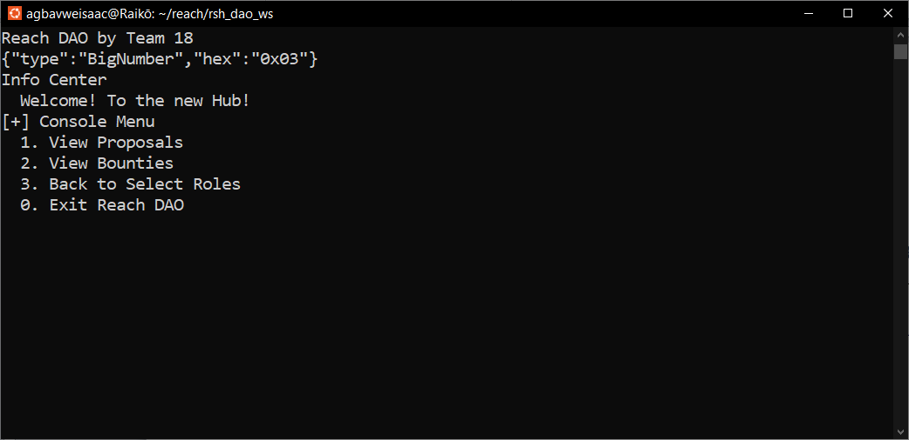
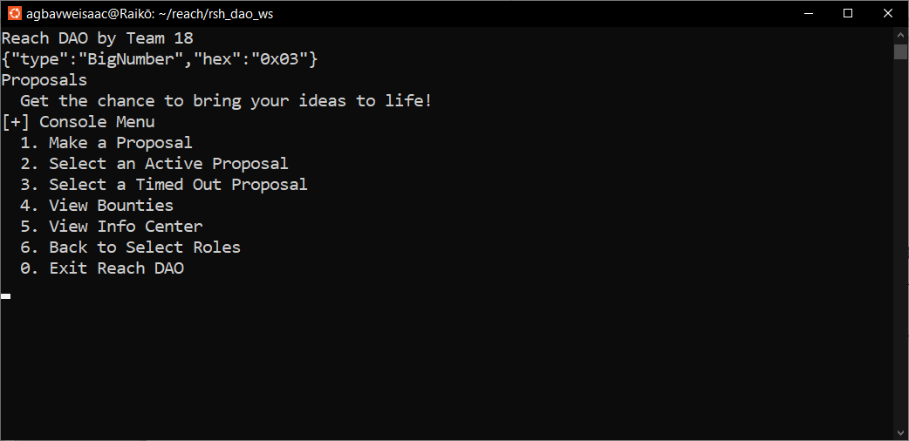
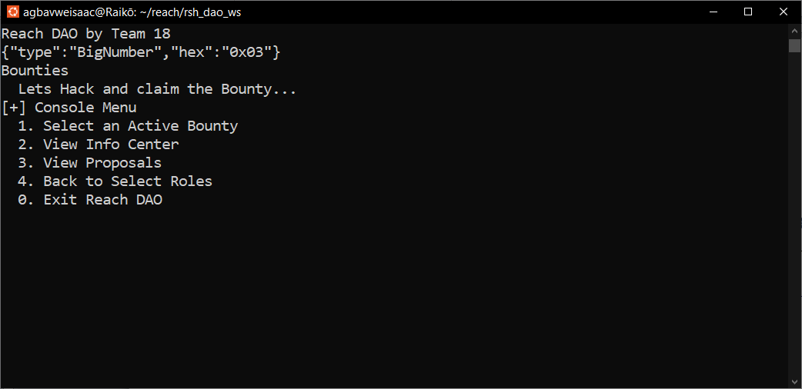

# Reach DAO

This project was created for the decentralized Umoja3 Bounty hack, organized by [Reach](bit.ly/3GJm5ep), the African Blockchain Alliance and Algorand.

The DApp allows any user to create a proposal for other users to contribute to and vote on. If the proposal passes, it becomes a bounty funded by the contributions as well as funds raised from sponsors. If the proposal does not pass, all users who contributed can claim a refund on the amounts that each of them contributed.  

We envision that a proposal could be a full scale DApp, a part of a DApp, a tutorial, frameworks or tools that make building with Reach easier and faster for developers. We do not limit proposals to this and look forward to creative ways users use our DApp.  

The central idea behind the Reach DAO is to allow projects to be executed or actualized faster by creating a means to incentivize them via bounties while also providing an avenue for Reach Developers to gain much needed experience and expertise and earn money while doing this.  

The end game is for the Reach DAO to be a hub for Reach developers with the benefit of the Reach community in mind, and we hope that users create proposals with this in mind.
Those who are not developers but have projects that they may want to execute are also invited to create proposals.

## Getting Started

### Pre-requisites and Local Development

Developers using this DApp should already have Reach and Docker installed on their local machines.

#### The guidelines for installation can be found below

- [Instructions for installing Reach and Docker](https://docs.reach.sh/quickstart/#qs-win-install)

You can get some testnet Algos from the [Algo Faucet](https://bank.testnet.algorand.network/), just incase you would prefer using an existing account to test out this DApp.

### Running the DApp

We recommend running the DApp using Ubuntu20.04 terminal.

#### Steps

1. Fork the Repository.

2. Clone the Repository.

3. Change Directory (cd) into the directory.

4. Run the following command to start up the DApp:  

```sh
./reach run
```

## Usage

>Note: We recommend running this project on two terminals, but strongly advise against running `./reach run` simultaneously. Instead after a successful build on the first terminal, then run the DApp on the second one. This is to prevent duplicate network names from being created on build.

1. Run the DApp in preferably two terminals.

2. After a successful build, the DApp would start on the terminal, afterwards you may decide to create an account (Only possible on Reach DevNet) or connect an existing account through the mnemonic.

3. After selecting your role, i.e. the Admin that deploys or an Attaché that attaches to a deployed contract, you would be greeted by the **Info Center view**.

4. Please navigate to the **Proposals view** by entering the corresponding menu option. You can then go ahead to create a proposal by selecting the **Make a Proposal** option from the menu and  filling out all the prompts and confirming the entries, after which the proposal would be created and added to the list of active proposals.  

5. After creating a proposal, you can go to the next terminal and connect as an Attaché following the processes described in Step 1 and navigate to the **Proposals view**. Then select the **Select an Active Proposal** option to see a list of active proposals and can go ahead to enter the ID of the proposal of interest to up vote, down vote or contribute to.  ****

A user may up vote, down vote or contribute to a proposal before the proposal deadline which starts counting as soon as the proposal is created, This is currently set to 20 blocks on Algorand, 2 blocks on ETH and 200 blocks on Conflux. You may change these values if you choose by changing the values on line 324 of the [index.mjs](./rsh_dao-vX/index.mjs) file in your code editor.  

If a proposal passes i.e. it has more up votes than down votes after the deadline elapses, the proposal is moved to the list of active bounties which can be found on the **Bounties view**. If the proposal fails then any user who contributed can claim a refund by navigating to the list of timed out proposals by selecting the **Select a Timed out Proposal** option on the **Proposal view**, and then entering the proposal ID.  

We encourage you to play around with the DApp and create as many proposals as you want to and up vote, down vote and contribute to them.  

## Troubleshooting

### [‼] A transaction clashed with a timeout

This simply means that the user tried to carry out a transaction such as a contribution, an up vote, or down vote, while the contract was enforcing operations for a timed out proposal.

### [‼] A transaction clashed with a teardown

This simply means that the user tried to carry out a transaction such as a contribution, an up vote, or down vote, while the contract was enforcing operations for a terminated proposal (A proposal that failed and its balance has been emptied by refunds).

Should you encounter any other errors, please tag either `goonerlabs#1008` 0r `Emmanuel Agbavwe#2954` in the help channel of the [Reach Discord Server](bit.ly/3BnPyKd).  

And the rest of the awesome team at Reach, The African Blockchain Alliance and The Algorand Foundation.

## The DApp

### The Info Center View



### The Proposals View



### The Bounties View



## Authors

- Owolabi Adeyemi
- Emmanuel Agbavwe

## Acknowledgements  

- [JP Miller](https://github.com/TheChronicMonster)
- [Nick Stanford](https://github.com/nstanford5)
- Melvin Wafula  

## Contributing

This project is open to contributions from great minded developers who share our goal to make development easier, and to bring more developers into Web3 through the [Reach Lang](https://github.com/Aro1914/Reach-Lang) and by building on the Algorand network.  

To contribute, simply:

- Fork this repo, make your updates and additions
- Create a GitHub discussion and bring your new ideas to our notice.
- Once approved, set up a pull request.
- After revision, your name will forever be among the wonderful developers who contributed to building Reach DAO.  

## License

The Reach DAO project is licensed under the [Apache License, Version 2.0](./LICENSE).
